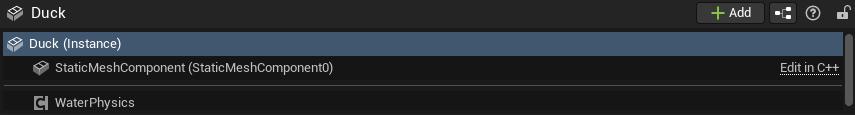
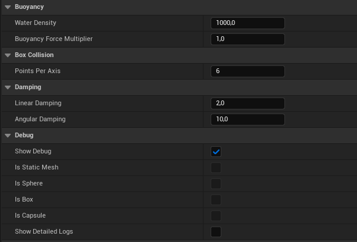

# Water Buoyancy Plugin

WaterPhysicsPlugin is an Unreal Engine plugin that implements realistic 3D buoyancy physics for floating objects. It integrates with UE's Water Plugin to provide automatic collision-based buoyancy, wave interaction, and realistic damping for Box, Sphere, Capsule, and Static Mesh collision types.

## Features

- Automatic collision detection

- Objects naturally follow wave motion

- Accurate buoyancy based on Archimede's Principle

- Real-time debug visualization of colliders and meshes out, on or under water.

- Configurable bouyancy varriables to create the floating of your choice

## Installation

1) Copy the WaterPhysicsPlugin folder into your project's Plugins directory:

```
UnrealProject/
└── Plugins/
    └── WaterPhysicsPlugin/ <-- here
```

2) Regenerate the project files and then rebuild the project.

3) IN CASE IT IS NOT ENABLED ALREADY BY DEFAULT, enable the plugin in Edit > Plugins > Installed > BouyancyPlugin .

## Usage

The WaterPhysicsComponent automatically sources any collisions that are currently simulating physics from your actor. You can just drag it and place it into your actor.



### Editor



From the editor, you can change the water's density and the bouyancy force multiplier if need be and increase the points per axis to increase precision. 
You can also tweak the linear and angular damping to your taste.


In order to debug, you can choose whether to have the normal debug on for the debug wireframe or the get all the detailed logs of that specific component.

